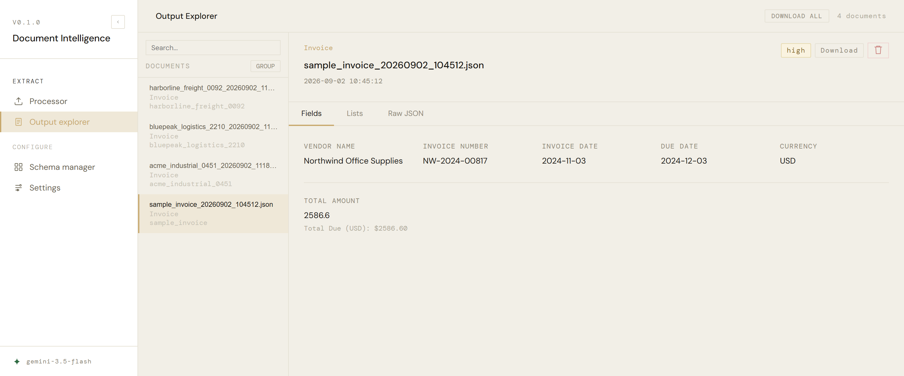
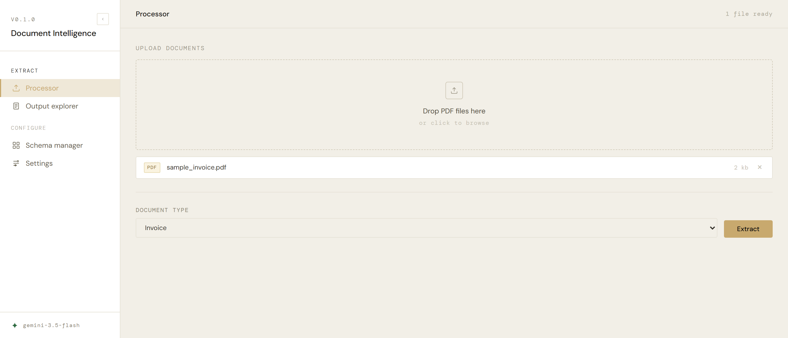
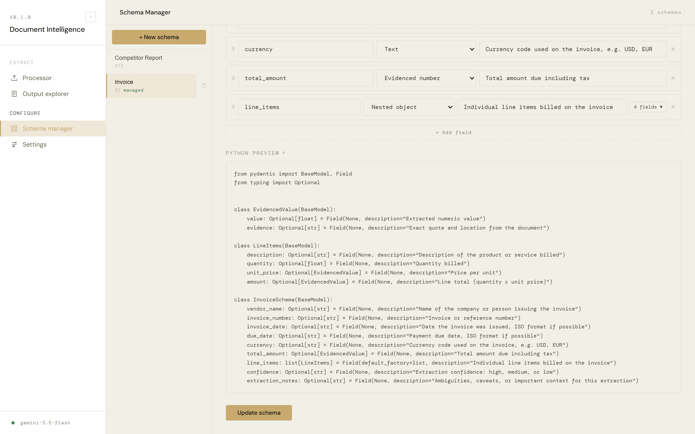
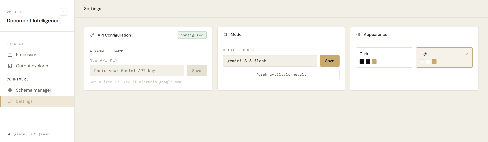
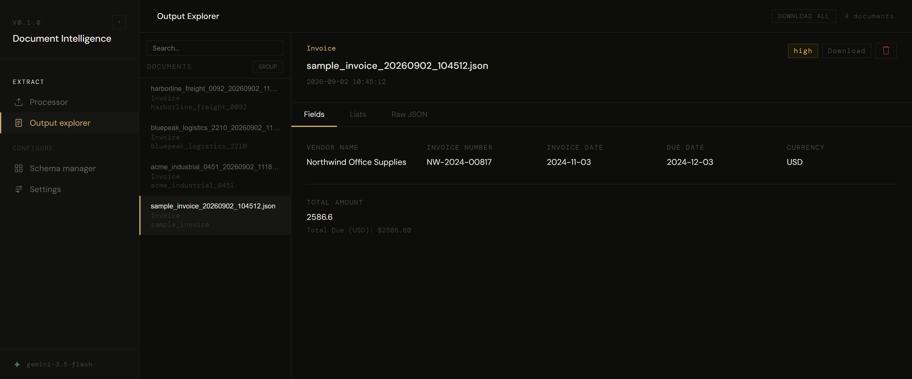

<div align="center">


# Document Intelligence

**Turn any PDF into structured, validated JSON, and check every number against the document it came from.**

[](https://github.com/RenatoGallicola/document-intelligence/actions/workflows/ci.yml)
[](LICENSE)
[](requirements.txt)
[](tests/)

</div>

Document Intelligence reads a PDF with a vision model and returns JSON that matches a schema you
define: invoices, annual reports, earnings releases, market briefs. Mixed layouts, tables, charts
and narrative text all go in the same way, with no per-layout parser. Every extracted number comes
back with the exact quote it was taken from, so a wrong one is visible instead of plausible. New
document types are defined from the web app, without writing Python.

<div align="center">
  
</div>

---

## Why this exists

There are two usual ways to get data out of a PDF, and both are unpleasant.

Template parsers (regex, bounding boxes, table detection) are precise until the vendor moves a
column, and then they are silently wrong. A model that reads the page instead of its coordinates
does not care about layout at all.

The other way is to ask an LLM and paste the JSON somewhere. That works right up to the moment
someone asks *where did this number come from*. A vision model reading a financial table can be
confidently, specifically wrong, and nothing in a bare JSON output tells you which fields to
distrust.

So this project takes the second approach and adds the part that makes it usable: **a schema the
output is validated against, and a source quote attached to every number.** The trade-off is
honest: it costs one API call per document, it is slower than a regex, and the model can still
misread. What it gives you is an output where checking a suspicious field takes five seconds
instead of reopening the PDF and hunting for the figure.

## Features

- **Any document type, no pipeline changes.** A type is a Pydantic schema plus a prompt. The
  extraction code is generic and never learns a field name.
- **Evidence on every number.** Numeric and claimed fields come back as
  `{ "value": ..., "evidence": "..." }`, quoting the document.
- **Schema Manager.** Create and edit document types from the browser: name it, add fields with
  types and descriptions, watch the generated Pydantic code build live, save. It writes
  `schemas/{name}.py`, `prompts/{name}.py` and registers the type.
- **Validated, not just parsed.** Pydantic checks the model's output; failures name the field, the
  value and the reason.
- **Truncation repair.** A response cut off mid-JSON is closed and salvaged rather than discarded.
- **Output Explorer.** Every past extraction, searchable, grouped by type, arrow-key navigable,
  downloadable one at a time or all at once as a `.zip`.
- **CLI as well as the app**, sharing the same pipeline, for batch and scripted use.
- **Light and dark themes**, from one set of design tokens.

## Quickstart

Python 3.12, Node.js, and a [Google Gemini API key](https://aistudio.google.com) (the free tier is
enough to try it).

```bash
git clone https://github.com/RenatoGallicola/document-intelligence.git
cd document-intelligence

python -m venv .venv
.venv\Scripts\activate         # Windows
# source .venv/bin/activate    # macOS / Linux
pip install -r requirements.txt

cd frontend && npm install && cd ..
```

Copy the example environment file and put your key in it:

```bash
cp .env.example .env      # Windows: copy .env.example .env
```

```
GEMINI_API_KEY=your_key_here
DEFAULT_MODEL=gemini-3.5-flash
```

Then run the two processes:

```bash
uvicorn backend.main:app --reload    # terminal 1: http://localhost:8000
cd frontend && npm run dev           # terminal 2: http://localhost:5173
```

Open [localhost:5173](http://localhost:5173), drop a PDF into the Processor, pick a document type,
extract. API docs are at [localhost:8000/docs](http://localhost:8000/docs).

> **No key yet?** The app runs without one: you can browse, design schemas and read past outputs.
> The Processor disables extraction and says why, rather than letting you upload a file and fail
> afterwards. You can paste the key later in Settings; it takes effect immediately, no restart.

## Example output

[`examples/invoice/`](examples/invoice/) holds a real, unedited pair: `sample_invoice.pdf` in,
`sample_invoice_output.json` out. Reproduce it yourself:

```bash
python pipeline.py --type invoice examples/invoice/sample_invoice.pdf
```

This is an excerpt; the committed file has all four line items:

```json
{
  "vendor_name": "Northwind Office Supplies",
  "invoice_number": "NW-2024-00817",
  "invoice_date": "2024-11-03",
  "due_date": "2024-12-03",
  "currency": "USD",
  "total_amount": { "value": 2586.6, "evidence": "Total Due (USD): $2586.60" },
  "line_items": [
    { "description": "Ergonomic Office Chair", "quantity": 4.0,
      "unit_price": { "value": 210.0, "evidence": "210.00" },
      "amount": { "value": 840.0, "evidence": "840.00" } }
  ],
  "confidence": "high",
  "extraction_notes": null
}
```

`confidence` and `extraction_notes` are on every schema. The model is told to mark a field `high`
only when it is explicitly labelled, and to use `extraction_notes` for anything ambiguous, which
is where it tells you that a figure was a nine-month subtotal rather than a full year.

## How it works

```
PDF ──► Gemini vision ──► parse ──► validate ──► store
        schema-driven     repair    Pydantic     output/*.json
        prompt, temp 0    if cut               
```

The schema is injected into the prompt as JSON Schema, so the model is given the exact field names
rather than asked to invent them. Five decisions are worth calling out, because each one came from
something that went wrong:

**Truncated responses are repaired, not thrown away.** Output is capped at 16 000 tokens, and a
dense annual report can still run past it, cutting the JSON mid-string. Discarding a
99%-complete extraction and paying for the call again is the wrong trade.
`_repair_truncated_json` walks the text tracking whether it is inside a string and how deep the
brackets go, closes what is open, and parses that.

**Only transient failures retry.** The first version caught `ClientError` wholesale, so an invalid
API key was retried four times across roughly thirty seconds before showing an error that was never
going to change, while genuine 5xx server errors, the ones actually worth retrying, were not
covered at all. Now `_is_retryable` admits 429, 5xx and empty responses; 400, 401 and 403 surface
immediately.

| Problem | What happens |
|---|---|
| No API key configured | Extraction is blocked in the Processor with an explanation, before upload |
| Invalid key, or malformed request (400 / 401 / 403) | Fails at once with the real error |
| Rate limit (429), server error (5xx), empty response | Up to 4 attempts, backing off 2s / 4s / 8s |
| Response cut off mid-JSON | Unclosed strings and brackets repaired, then parsed |
| Output violates the schema | Validation error naming the field, its value and the reason |

**Every number carries its source.** `EvidencedValue` is `{value, evidence}`, and the prompt
requires the evidence to be a quote from the document. A number you cannot trace is a number you
have to re-check by hand anyway, so tracing it is not overhead: it is the difference between an
output you can act on and one you have to audit. (A Pydantic detail that cost an afternoon: these
fields must be `Optional[EvidencedValue] = None`, never `default_factory`, or a legitimate `null`
from the model fails validation.)

**The frontend never knows a field name.** Output Explorer renders by *shape*: `isEvidencedValue`
recognises `{value, evidence}` structurally, arrays of objects become tables, primitives become
rows. A schema created two minutes ago in Schema Manager displays correctly with no frontend change
at all. The single exception is the left-panel title, which tries a short list of likely key names
(`company_name`, `title`, `name` and so on) and falls back to the filename, a deliberate
and contained exception.

**Schema Manager splices `config.py`, it does not rewrite it.** Parsing the file and re-serialising
it would work and would also strip every comment and reformat everything around the change. Instead
`_update_config` finds the end of the `DOCUMENT_TYPES` dict by tracking brace depth and inserts the
new entry there. `SchemaManager.tsx` mirrors the same generation rules client-side for the live
preview; if the rules change, both sides have to change together.

## The app

Four pages, in the sidebar.

**Processor**: drag in PDFs, choose a document type, extract. Live progress, and a per-file summary
of which fields came back and which were null. It reads the API-key status on load and refuses to
start without one.

<div align="center">
  
</div>

**Output Explorer**: every past extraction. Search, group by type, navigate with arrow keys,
inspect fields, lists and raw JSON, download one result or all of them as a `.zip`, delete. Nothing
in this page is written against a particular schema; see *How it works* below.

**Schema Manager**: build a document type in the browser. Add fields (`str`, `float`, `int`,
`bool`, `EvidencedValue`, `EvidencedStr`, `list[str]`, nested objects), give each a description that
becomes part of the model's instructions, and watch the Pydantic source appear as you type.
`confidence` and `extraction_notes` are appended automatically, because the base prompt always asks
for them. Schemas written by hand (like `competitor_report.py`, which has custom validators) are
listed but not editable here.

<div align="center">
  
</div>

**Settings**: API key, default model, and appearance. The model is one global setting, not one per
schema: switching model is something you do to compare cost and quality across everything, not to
tune a single document type.

<div align="center">
  
</div>

Light and dark are the same brand: the gold accent and its contrast text are identical in both, and
only the neutral ramp inverts. Every colour comes from one set of tokens in `frontend/src/theme/`,
never a hex literal in a component. Here is the Output Explorer from the top of this page again,
this time in dark:

<div align="center">
  
</div>

## Adding a document type

**From the app**, which covers most cases: Schema Manager → *New schema* → name it, add fields, save.
This generates the schema, a starter prompt, and the `config.py` entry.

**By hand**, when you need custom validators, enums or cross-field logic. Add
`schemas/your_type.py` with a Pydantic model whose class name ends in `Schema`, add
`prompts/your_type.py` with a `YOUR_TYPE_INSTRUCTIONS` string, then register both:

```python
DOCUMENT_TYPES = {
    "your_type": {
        "schema": YourTypeSchema,
        "prompt": build_prompt(YourTypeSchema, YOUR_TYPE_INSTRUCTIONS),
    },
}
```

Either way it appears in the Processor dropdown immediately. The class name is derived from the
type name: `market_report` → `MarketReportSchema`.

<details>
<summary><b>Writing a good prompt</b></summary>

`build_prompt()` supplies the generic half: return valid JSON, use the schema's exact field names,
return `null` rather than guessing, and set `confidence` / `extraction_notes`. Your
`{TYPE}_INSTRUCTIONS` string adds the domain half, and this is where extraction quality actually
comes from. Useful things to put in it:

- What the document usually calls the thing you want ("*operating margin* may appear as *EBIT
  margin*")
- Which unit and scale to normalise to, and what to do with thousands separators
- What to do when a figure is a subtotal, restated, or covers a different period
- What *not* to extract, when a document contains tempting look-alikes

</details>

<details>
<summary><b>API endpoints</b></summary>

| Method | Path | Description |
|---|---|---|
| `GET` | `/api/health` | Health check |
| `POST` | `/api/documents/process` | Extract from a PDF (multipart: `file` + `document_type`) |
| `GET` | `/api/documents/outputs` | List past extractions |
| `DELETE` | `/api/documents/outputs/{filename}` | Delete one |
| `GET` | `/api/schemas` | List document types |
| `GET` | `/api/schemas/{id}` | Fields of one schema |
| `POST` | `/api/schemas` | Create a schema (generates the files, updates `config.py`) |
| `PUT` | `/api/schemas/{id}` | Update a Schema-Manager-created schema |
| `DELETE` | `/api/schemas/{id}` | Delete one |
| `GET` | `/api/settings` | API-key status and default model |
| `POST` | `/api/settings/api-key` | Set the key |
| `POST` | `/api/settings/model` | Set the default model |
| `GET` | `/api/settings/models` | Models the key can reach |

Only schemas created through Schema Manager (tracked in `schemas/_registry.json`) can be edited or
deleted through the API. Hand-written ones are read-only, so a `PUT` cannot quietly destroy a custom
validator.

</details>

<details>
<summary><b>CLI</b></summary>

```bash
# the bundled sample
python pipeline.py --type invoice examples/invoice/sample_invoice.pdf

# every PDF in input/
python pipeline.py

# specific files, specific type
python pipeline.py --type competitor_report input/report_a.pdf input/report_b.pdf
```

Results land in `output/{source_pdf_stem}_{timestamp}.json`, the same place and format the app
reads, so anything processed on the command line shows up in Output Explorer.

To see which models your key can actually reach:

```bash
python utils/list_models.py
```

</details>

## Project layout

```
document-intelligence/
├── backend/
│   ├── main.py                # FastAPI app, CORS, routers, logging
│   └── routers/
│       ├── documents.py       # process, list, delete outputs
│       ├── schemas.py         # schema CRUD + code generation
│       └── settings.py        # API key, model
├── core/
│   └── prompt_builder.py      # schema -> prompt, for any schema
├── schemas/                   # Pydantic models (invoice, competitor_report, generated)
├── prompts/                   # domain instruction strings
├── frontend/src/
│   ├── theme/                 # tokens, shared style factories, light/dark context
│   ├── components/            # Sidebar, ProgressBar
│   └── pages/                 # Processor, OutputExplorer, SchemaManager, Settings
├── examples/invoice/          # a real, unedited PDF -> JSON pair
├── tests/                     # 82 tests, no key and no network required
│   └── fixtures/              # recorded model responses, one truncated on purpose
├── .env.example               # copy to .env
├── config.py                  # DOCUMENT_TYPES, the one registry
├── extractor.py               # Gemini call, retry policy, parse, truncation repair
├── validator.py               # Pydantic validation + extraction summary
├── storage.py                 # write result to output/
└── pipeline.py                # orchestration + CLI
```

`config.py` is the single source of truth for document types; everything else discovers them from
it.

## Development

```bash
pip install -r requirements-dev.txt
pytest              # 82 tests, ~4 seconds
ruff check .

cd frontend
npm run lint
npm run build       # tsc -b && vite build: type check and production build
```

**The suite needs no API key, no network and no Gemini client.** The client is built lazily inside
`extractor._get_client()` and the key it was built with is remembered, so the module imports on a
fresh clone, every pure helper is reachable, and a key changed in Settings rebuilds the client
instead of being ignored until a restart. CI sets no `GEMINI_API_KEY` anywhere, on purpose: if a
test could reach the network, that would be the thing to fix.

What is covered: truncation repair and response parsing, the retry predicate, schema validation and
the extraction summary, the prompt builder, and Schema Manager's code generation, including a
round-trip test asserting that adding a schema to `config.py` and removing it again returns the file
to byte-for-byte what it was.

`tests/test_end_to_end.py` runs the whole path (PDF on disk to validated JSON in `output/`) with
only `generate_content` replaced, by a response recorded from the genuine sample extraction
([`tests/fixtures/`](tests/fixtures/)). One of those fixtures is deliberately cut off mid-string, so
truncation repair is exercised end-to-end and not only as a unit.

`ruff` runs the pyflakes and pycodestyle-error rules only. The stylistic rulesets are deliberately
off: `schemas/` uses `Optional[...]` because that is exactly what Schema Manager generates, and a
linter rewriting it to `X | None` would put hand-written and generated schemas permanently out of
step.

On the frontend, `react-hooks/set-state-in-effect` is a warning rather than an error. It flags five
pre-existing effects (four in `OutputExplorer.tsx`, one in `SchemaManager.tsx`) that set state
synchronously. They are hook hygiene rather than defects, and fixing them properly means moving
derived state into render, which deserves to be done deliberately with the behaviour checked by
hand. Everything else in ESLint still fails the build.

## Known limitations

- **One vision model.** The extractor talks to `google-genai` directly. Swapping providers means
  editing `call_gemini`, not a config value.
- **The recorded fixtures can go stale.** They are a snapshot of what the model returned once. If
  Gemini's output shape changes, the suite stays green while real extractions break, and no stub can
  tell you that.
- **No frontend unit tests.** The frontend is covered by lint, type checking and a production build
  only; the shape-based rendering in Output Explorer has no test of its own.
- **Consolidated fields are often null,** and that is usually correct: many issuers simply do not
  report them. Check `extraction_notes` before assuming a miss.
- **Model lists can include models that cannot extract.** `/api/settings/models` filters on
  `supported_actions` because the raw list contains entries without `generateContent`.

## License

[MIT](LICENSE) © Renato Gallicola
